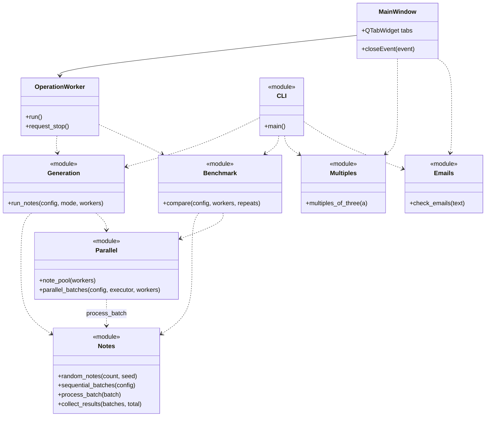

# Компоненты лабораторной работы № 4

```mermaid
classDiagram
    class MainWindow {
        +QTabWidget tabs
        +closeEvent(event)
    }
    class OperationWorker {
        +run()
        +request_stop()
    }
    class CLI {
        <<module>>
        +main()
    }
    class Generation {
        <<module>>
        +run_notes(config, mode, workers)
    }
    class Benchmark {
        <<module>>
        +compare(config, workers, repeats)
    }
    class Notes {
        <<module>>
        +random_notes(count, seed)
        +sequential_batches(config)
        +process_batch(batch)
        +collect_results(batches, total)
    }
    class Parallel {
        <<module>>
        +note_pool(workers)
        +parallel_batches(config, executor, workers)
    }
    class Multiples {
        <<module>>
        +multiples_of_three(a)
    }
    class Emails {
        <<module>>
        +check_emails(text)
    }
    MainWindow --> OperationWorker
    MainWindow ..> Multiples
    MainWindow ..> Emails
    OperationWorker ..> Generation
    OperationWorker ..> Benchmark
    CLI ..> Generation
    CLI ..> Benchmark
    CLI ..> Multiples
    CLI ..> Emails
    Generation ..> Notes
    Generation ..> Parallel
    Benchmark ..> Notes
    Benchmark ..> Parallel
    Parallel ..> Notes : process_batch
```
